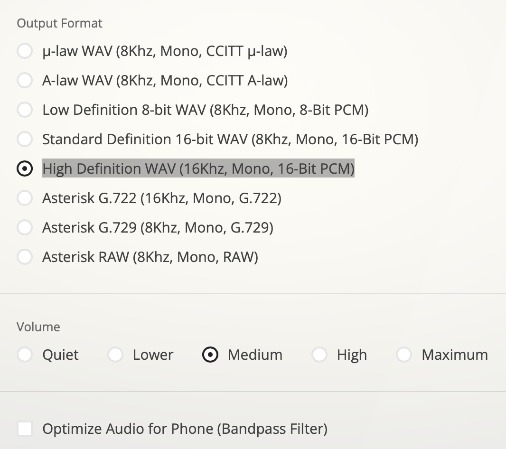

<table>
    <th>
      <a href="./README.md"><< CHƯƠNG TRƯỚC</a>
    </th>
    <th>
      1/3
    </th>
    <th>
      <a href="./chap2.md">CHƯƠNG SAU >></a>
    </th>
</table>

## 2. Làm việc với file WAV
### 2.1. Xác định các tham số, thông số file


Với yêu cầu sử dụng định dạng <b>wav</b> để làm việc cùng, chúng ta cũng cần xác định được các thông số đặc trưng:
- <b>encoding</b>: Cách mã hoá
  <b>=> PCM</b>
- <b>channels</b>: Số kênh âm thanh (1 cho mono, 2 cho stereo)
  <b>=> mono (Đơn âm sắc)</b>
- <b>sample_width/bit_depth</b>: Số byte cho mỗi mẫu âm thanh
  <b>=> 2 bytes (16 bit)</b>
- <b>frame_rate</b>: Tần số mẫu (số mẫu âm thanh trên giây)
  <b>=> 16 KHz (16000 mẫu/giây)</b>
- <b>num_frames</b>: Số frame âm thanh
  <b>=> Tuỳ file</b>
- <b>duration = num_frames / frame_rate</b>: Thời lượng (giây)
  <b>=> Tuỳ file</b>
- <b>is_signed</b>: Giá trị có dấu hay không có dấu
  <b>=> Có dấu</b>
- <b>is_integer</b>: Giá trị nguyên hay thực
  <b>=> Nguyên</b>
- <b>is_fixedpoint</b>: Giá trị dấu phẩy tĩnh hay dấu phẩy động (nếu là số thực)
  <b>=> Không tĩnh không động</b>
- ...
### 2.2. Tương tác file WAV
#### 2.2.1. Chuyển đổi định dạng
Trong quá trình thực hiện, chúng ta có thể cần chuyển đổi các định dạng âm thanh khác về WAV với các cài đặt về thông số như đã mô tả ở mục trước. Việc này có thể đạt được thông qua sử dụng các nền tảng chuyển đổi định dạng tệp tin trực tuyến. Ở đây tôi sử dụng trang web <a href="https://g711.org">g711.org</a>, chọn tham số phù hợp cho file đầu ra như sau:



#### 2.2.2. Lớp Wav để xử lý các tác vụ
Sử dụng ngôn ngữ lập trình Python cùng với thư viện <a href="https://scipy.org">scipy</a> và <a href="https://docs.python.org/3/library/wave.html">wave</a>, tôi tạo một lớp Wav để có thể xử lý các tác vụ cần thiết lên trên file:
- __open__: mở file wave với đường dẫn và đọc, lưu dữ liệu vào các thuộc tính tương ứng trong đối tượng của lớp Wav.
- __print__: tả thông tin về đối tượng.
- __save_as__: lưu đối tượng này thành một file WAV vào đường dẫn.
- __save_as_txt__: lưu đối tượng này thành một file .txt vào đường dẫn. Mỗi dòng sẽ tương ứng với một mẫu giá trị biên độ của âm thanh, thể hiện dưới dạng bit. VD:
    ```
    . . .
    1111110100100011
    1111110110011101
    1111110001110010
    . . .
    ```
- __load_from_txt__: nạp các mẫu âm thanh từ file .txt vào đối tượng.
- __combine_wav__: kết hợp đối tượng với một đối tượng Wav khác bằng cách biến đổi Fourier sang miền tần số, cộng với nhau sau đó biến đổi ngược lại về miền thời gian.
- __sum_wav__: kết hợp đối tượng với một đối tượng Wav khác bằng cách cộng các mẫu trong miền thời gian với nhau.
- __apply_filter__: áp dụng bộ lọc lên đối tượng.
- __gain__: nhân miền tần số của đối tượng lên.
- __mul__: nhân miền thời gian của đối tượng lên.
- __resample__: thay đổi sample_rate (tốc độ lấy mẫu) của đối tượng. VD: 16000 --> 20000 (Hz).
- và một số hàm hỗ trợ khác được cung cấp trong lớp Wav này...

<table>
    <th>
      <a href="./README.md"><< CHƯƠNG TRƯỚC</a>
    </th>
    <th>
      1/3
    </th>
    <th>
      <a href="./chap2.md">CHƯƠNG SAU >></a>
    </th>
</table>