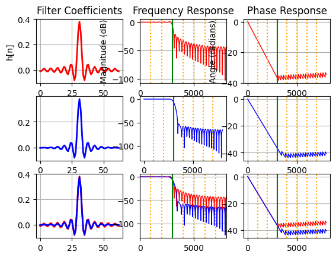

<table>
    <th>
      <a href="./chap1.md"><< CHƯƠNG TRƯỚC</a>
    </th>
    <th>
      2/3
    </th>
    <th>
      <a href="./chap3.md">CHƯƠNG SAU >></a>
    </th>
</table>

## 3. Bộ lọc
Để có một bộ lọc tốt cần cân bằng giữa các yếu tố và thường là có sự đánh đổi lẫn nhau như chất lượng bộ lọc cao sẽ có độ trễ và độ phức tạp tính toán cao, khó triển khai phần cứng,...

Các tham số bộ lọc sẽ phụ thuộc vào tính chất của tín hiệu. VD: tín hiệu có băng tần rộng thì khi chia 8 dải tầng sẽ thoải mái hơn cho việc rò rỉ, ISI giữa các vùng đáp ứng xung của các bộ lọc với nhau. Tín hiệu có độ tập trung năng lượng cao vào vùng tần số nào thì chất lượng của bộ lọc tại vùng tần số đó cần được đảm bảo hơn...

Để cho đơn giản, chúng ta sẽ cố gắng thiết kế các bộ lọc với số lượng mẫu phản ứng xung giống nhau và số mẫu này là tối thiểu sao cho vẫn giữ được đặc tính cũ của tín hiệu gốc (ở mức độ tương đối, không tệ quá là được hehee). Việc này sẽ giúp việc thiết kế trên phần cứng sử dụng ngôn ngữ mô tả phần cứng dễ dàng hơn, dễ dàng tính toán, tuỳ chỉnh tổ hợp các mẫu phản ứng xung trên từng bộ lọc.
### 3.1. FIR và IIR
#### 3.1.1. FIR
##### 3.1.1.1. Đặc điểm
Bộ lọc FIR có đáp ứng xung hữu hạn, có nghĩa là đáp ứng đầu ra sẽ dần dần giảm xuống không sau một số lượng mẫu hữu hạn.
Đầu ra phụ thuộc vào hệ số của bộ lọc tích chập lên đầu vào hiện tại cũng như các mẫu trước đó.

Thường thì cấu trúc của FIR sẽ là một bộ Feedforward như hình trên. Có thể thấy FIR filter thường được thiết kế để có phản hồi xung không có phản hồi ngược, điều này có nghĩa là không có các hệ số trong hàm truyền tải phản hồi về các thành phần tính toán trước đó.
Vì không có phản hồi ngược, FIR filter thường dễ thiết kế và ổn định hơn trong các ứng dụng yêu cầu chính xác cao.
##### 3.1.1.2. Ưu và nhược:
###### a) Ưu điểm:
- <b>Đáp ứng pha tuyến tính</b>, có nghĩa là tất cả các tần số trải qua cùng một lượng trễ qua bộ lọc. Điều này quan trọng trong các ứng dụng yêu cầu bảo toàn mối quan hệ pha của tín hiệu đầu vào, đặc biệt trong <b style="color:red;">xử lý âm thanh và hình ảnh</b>.
- <b>Ổn định</b>. Đáp ứng pha, phổ của hệ thống là an toàn, không gặp phải một số vấn đề khiến cho đầu ra của tín hiệu bị thay đổi hoàn toàn như một số trường hợp mà bộ lọc IIR có thể gặp phải.
- <b>Dễ thiết kế, chỉnh sửa, triển khai</b>. Việc thay đổi các tham số của bộ lọc chỉ là việc thay các mẫu phản ứng xung trong các thanh ghi tính toán.

###### b) Nhược điểm:
- <b>Độ phức tạp tính toán cao</b>, đòi hỏi nhiều tài nguyên tính toán hơn so với bộ lọc IIR, đặc biệt là đối với bộ lọc cấp cao hoặc bộ lọc có số lượng tapsn (mẫu phản ứng xung h[n]) lớn.
- <b>Đáp ứng đột ngột</b> dài hơn so với bộ lọc IIR, đặc biệt là đối với các chuyển đổi sắc nét trong miền tần số. Tức là khi tín hiệu thay đổi biên độ rất nhanh thì bộ lọc FIR sẽ cần thêm thời gian để thích ứng. Nhưng điều này không phải là một vấn đề quá lớn khi chúng ta đang focus vào ứng dụng trong audio singal, thứ mà thường sẽ có dải sóng thay đổi không quá đột ngột.
#### 3.1.2. IIR
##### 3.1.2.1. Đặc điểm
Bộ lọc IIR có đáp ứng xung vô hạn, có nghĩa là đầu ra có thể phụ thuộc vào một lịch sử vô hạn các mẫu đầu vào.
Đầu ra là đệ quy của cả đầu vào hiện tại và các mẫu đầu ra trước đó kết hợp cùng phản hồi của đầu ra.

Thường thì cấu trúc của IIR sẽ là một bộ Feedforward kết hợp Feedbackward như hình trên.
##### 3.1.2.2. Ưu và nhược:
###### a) Ưu điểm:
- Đòi hỏi ít tài nguyên tính toán hơn so với bộ lọc FIR để đạt được các đặc tính bộ lọc tương tự.
- Hiệu quả hơn cho việc lọc dải hẹp: Bộ lọc IIR thường hiệu quả hơn cho các ứng dụng lọc dải hẹp.
###### b) Nhược điểm:
- <b>Biến dạng pha phi tuyến</b> có thể ảnh hưởng tới các ứng dụng yêu cầu bảo toàn mối quan hệ pha, như xử lý âm thanh, hình ảnh!
- <b>Xuất hiện dao động không ổn định</b> trong một số điều kiện.
- <b>Hạn chế thiết kế</b> với các đáp ứng tần số cụ thể, đặc biệt là để đạt được các đặc tính pha tuyến tính.
#### 3.1.3. Lựa chọn loại bộ lọc
IIR filter thường có thể đạt được hiệu suất cao hơn với số lượng bộ lọc nhỏ hơn so với FIR filter, nhưng cũng không ổn định nếu không được thiết kế cẩn thận. Ngoài ra đáp ứng pha không tuyến tính có thể khiến cho các đặc điểm gốc trong tín hiệu bị biến dạng, điều này không phù hợp cho yêu cầu của chúng ta đó chính là xử lý tín hiệu âm thanh.
FIR filter thường được sử dụng cho các ứng dụng yêu cầu độ chính xác cao, ổn định tốt như lọc tần số cụ thể hoặc làm sạch tín hiệu, xử lý audio, image. Vậy thì chúng ta đành phải đánh đổi về mặt tài nguyên phần cứng, tốc độ xử lý, độ trễ tính toán,... để có thể thực hiện loại bộ lọc FIR lên FPGAs.
<b>=> CHỐT: SỬ DỤNG BỘ LỌC FIR TRONG THIẾT KẾ</b>.

### 3.2. Thiết kế bộ lọc FIR
#### 3.2.1. Lựa chọn phương pháp thiết kế
##### 3.2.1.1. Các phương pháp:
###### a) Phương pháp cửa sổ (Window method):
Phương pháp này bao gồm việc lấy Fourier của một phản ứng yêu cầu với hàm cửa sổ như cửa sổ Hamming, cửa sổ Blackman, cửa sổ Kaiser,... và sau đó chuyển đổi Fourier ngược trở lại để lấy được hệ số của bộ lọc FIR.

##### b) Các phương pháp khác:
- __Phương pháp đồng bộ (Equiripple method)__: Đây là một phương pháp thiết kế bộ lọc FIR đặc biệt dùng cho các ứng dụng yêu cầu sự đồng đều về biên độ trên dải tần số cụ thể. Ví dụ, phương pháp Parks-McClellan là một phương pháp phổ biến trong phương pháp này.
- __Phương pháp tối thiểu bình phương (Least squares method)__: Phương pháp này tìm kiếm hệ số của bộ lọc FIR sao cho độ lỗi bình phương giữa phản ứng yêu cầu và phản ứng của bộ lọc là nhỏ nhất.
- __Phương pháp đệ quy (Recursive method)__: Đối với các bộ lọc FIR có độ dài lớn, việc tính toán hệ số có thể trở nên tốn kém. Trong trường hợp này, có thể sử dụng phương pháp đệ quy để tính toán hệ số bộ lọc một cách hiệu quả hơn.
- __Phương pháp tối ưu hóa (Optimization method)__: Sử dụng các thuật toán tối ưu hóa như thuật toán di truyền, thuật toán tối ưu hóa hạt giống, hoặc các phương pháp tối ưu hóa liên tục để tìm ra bộ lọc FIR tối ưu dựa trên các tiêu chí như độ trễ, độ rộng dải tần số chuyển đổi, hoặc tiêu chuẩn cụ thể khác.
##### 3.2.1.2. Chốt lựa chọn
__Phương pháp cửa sổ__ được chọn để sử dụng trong việc thiết kế bộ lọc FIR vì:
- __Dễ hiểu và triển khai__: Phương pháp cửa sổ dựa trên việc lấy Fourier của phản ứng yêu cầu với một hàm cửa sổ nhất định và sau đó chuyển đổi Fourier ngược trở lại để lấy được hệ số của bộ lọc FIR. Quy trình này tương đối đơn giản và dễ triển khai.
- __Đáp ứng tần số tốt__: Các hàm cửa sổ như cửa sổ Hamming, cửa sổ Blackman, và cửa sổ Kaiser thường được sử dụng trong phương pháp cửa sổ. Những cửa sổ này có đáp ứng tần số tốt, giảm thiểu hiện tượng rò rỉ tần số (frequency leakage) và nén tín hiệu (signal smearing) trong quá trình chuyển đổi Fourier.
- __Kiểm soát độ rộng dải tần số chuyển đổi__: Với việc lựa chọn hàm cửa sổ phù hợp, có thể kiểm soát độ rộng của dải tần số chuyển đổi của bộ lọc FIR. Điều này quan trọng trong việc đảm bảo rằng bộ lọc chỉ áp dụng các biến đổi tần số vào dải tần số cần thiết mà không ảnh hưởng đến các thành phần tần số khác của tín hiệu.
#### 3.2.2. Lựa chọn loại cửa sổ

Phần report + code cho hiển thị tương tác trực quan với phổ có thể được tìm thấy ở đây: 

##### 3.2.2.1. So sánh đáp ứng tần số và đáp ứng pha
###### a) Cửa sổ chữ nhật (Boxcar/rectangle) vs cửa sổ Hamming

* Màu đỏ: Cửa sổ chữ nhật

* Màu xanh: Cửa sổ Hamming

* __Lưu ý__: bảng tổng hợp nên hình khá nhỏ, click vào ảnh để xem rõ hơn từng trường hợp so sánh.

<table>
  <thead>
    <th>N</th>
    <th>Thông thấp</th>
    <th>Thông cao</th>
    <th>Thông dải</th>
  </thead>
  <tbody>
    <tr>
      <td>7</td>
      <td></td>
      <td></td>
      <td></td>
    </tr>
    <tr>
      <td>63</td>
      <td></td>
      <td></td>
      <td></td>
    </tr>
    <tr>
      <td>1023</td>
      <td></td>
      <td></td>
      <td></td>
    </tr>
  </tbody>
</table>

###### b) So sánh các loại cửa sổ khác

Nếu muốn so sánh các loại cửa sổ khác nhau, hãy dùng giao diện được cung cấp trong  để tự khám phá và đánh giá nhé!

Lưu file code về Google Drive của bạn sau đó chọn __Thời gian chạy__ > __Chạy tất cả__ để bắt đầu:

##### 3.2.2.2. Chốt lựa chọn
Cửa sổ Hamming là một trong những loại cửa sổ phổ biến được sử dụng trong thiết kế bộ lọc FIR cho tín hiệu âm thanh.
###### a) Ưu điểm:
- Giảm rò rỉ tần số (frequency leakage): Cửa sổ Hamming giúp giảm thiểu hiện tượng rò rỉ tần số trong quá trình biến đổi Fourier, điều này quan trọng để đảm bảo rằng bộ lọc FIR hoạt động hiệu quả trên dải tần số mong muốn mà không gây ra nhiễu ở các tần số khác.
- Độ phản ứng bậc hai (side lobe) thấp: Cửa sổ Hamming có đặc điểm là có side lobe thấp, điều này có nghĩa là các điểm tần số bên cạnh đáp ứng chính ít ảnh hưởng đến kết quả của bộ lọc FIR.
###### b) Nhược điểm:
- Có độ rộng dải chuyển đổi (transition bandwidth) lớn hơn: So với một số cửa sổ khác như cửa sổ Kaiser, cửa sổ Hamming có độ rộng dải chuyển đổi lớn hơn, điều này có thể gây ra hiện tượng mất độ dốc (rolloff) nhanh hơn ở các cực tần số, có thể làm giảm hiệu suất của bộ lọc FIR trong một số ứng dụng cụ thể.

__=> CHỐT: SỬ DỤNG BỘ LỌC FIR THIẾT KẾ VỚI PHƯƠNG PHÁP CỬA SỔ, LỰA CHỌN CỬA SỔ HAMMING.__

### 3.2. Phân tích phổ tín hiệu, phổ tần số
#### 3.2.1. File gốc

https://github.com/Qyt0109/Verilog-8-Band-Audio-Equalizer/assets/92682344/a0692e70-c902-4dc9-9eb7-f4c0a3fb804e

#### 3.2.2. Sử dụng các bộ lọc
##### 3.2.2.1. Các bộ lọc chất lượng cao, thực hiện trên phần mềm viết bằng Python
Với chất lượng bộ lọc tốt, số lượng mẫu phản ứng xung (impulse response taps) N = 1023, cửa sổ Hamming.
###### a) LPF

https://github.com/Qyt0109/Verilog-8-Band-Audio-Equalizer/assets/92682344/15adc480-3bbe-4c50-8180-b1b65febd71f

Lọc thông thấp (Low Pass Filter) với tần số cắt fc = 1000 (Hz). Âm thanh sau khi lọc chỉ còn lại những nốt trầm, nghe ồm ồm, ầm ầm còn những âm thanh với tần số cao (chói tai) đã bị cắt bỏ.

Đáp ứng xung (Frequency Response):

Tín hiệu sau lọc có phổ giới hạn tối đa tương ứng với tần số cắt, gần như không có sự rò rỉ tần số:

###### b) HPF

https://github.com/Qyt0109/Verilog-8-Band-Audio-Equalizer/assets/92682344/3fd25c70-9f6b-42dc-8d69-16a0c6e711cf

Lọc thông cao (High Pass Filter) với tần số cắt fc = 7000 (Hz). Sau khi lọc có thể nghe được âm thanh rất chói tai, vì sau khi cắt với bộ lọc thông cao, những âm thanh còn lại là những âm ở tần số cao.

Đáp ứng xung (Frequency Response):

Tín hiệu sau lọc có phổ giới hạn tối thiểu tương ứng với tần số cắt, gần như không có sự rò rỉ tần số:

###### c) BPF

https://github.com/Qyt0109/Verilog-8-Band-Audio-Equalizer/assets/92682344/b3fd8ca6-ea07-4787-adc6-8db8b5d47939

Lọc thông dải (Band Pass Filter) với tần số cắt fc = (fc_l, fc_h)  = (3000, 5000) (Hz). Sau khi cắt thì nghe cũng thấy khác khác so với âm thanh gốc nhưng không cụ thể lắm nên khá khó mô tả chi tiết.

Đáp ứng xung (Frequency Response):

Tín hiệu sau lọc có phổ giới hạn tương ứng với tần số cắt, gần như không có sự rò rỉ tần số:

#### 3.2.3. Kết hợp các bộ lọc
##### 3.2.3.1. Các phép toán trên miền thời gian và miền tần số
Các phép toán trong miền thời gian (time domain) có ảnh hưởng đến miền tần số (frequency domain):
- __Phép cộng (Addition)__: Trong miền thời gian, phép cộng giữa hai hàm tương đương với việc thực hiện phép cộng tương ứng giữa các thành phần tần số của hai hàm trong miền tần số.
- __Phép nhân (Multiplication) và tích chập (Convolution)__: Phép nhân trong miền thời gian tương đương với việc thực hiện tích chập trong miền tần số và ngược lại.
- __Đổi dấu (Time reversal) và phép phản xạ (Conjugate)__: Đổi dấu của một hàm trong miền thời gian tương đương với việc lấy phản xạ của phổ tần số của hàm đó trong miền tần số.
- __Đẩy dịch thời gian (Time shifting)__: Đẩy dịch thời gian của một hàm trong miền thời gian tương đương với việc nhân hàm đó với một hàm có phổ tần số là hàm mũ phức số phức trong miền tần số.
- __Scale (Tăng/giảm tỷ lệ)__: Việc tăng hoặc giảm tỷ lệ của một hàm trong miền thời gian tương đương với việc thay đổi biên độ của phổ tần số của hàm đó trong miền tần số.
- ...

Những phép toán này giúp chúng ta hiểu rõ cách các tín hiệu và hàm trong miền thời gian tương tác với nhau trong miền tần số và ngược lại. Điều này rất hữu ích trong việc phân tích và xử lý tín hiệu âm thanh.
##### 3.2.3.2. Kết hợp sử các filter trên cùng một tín hiệu
###### a) Phân tích vấn đề
Chúng ta có 8 bộ lọc tương ứng với 8 dải tần và cần kết hợp chúng với nhau thể điều khiển gain từ đó tăng giảm được biên độ (Magnitude) (dB) của từng dải một. Vậy thì làm thế nào để chúng làm việc được với nhau?

###### b) Ghép 8 băng tần kiểm soát bởi các bộ lọc
Giả sử tắt hết các băng tần của bộ BPF ở giữa, chúng ta chỉ đang quan tâm tới 2 dải băng LPF và HPF.

Phổ tần số gốc của tín hiệu trước khi lọc:

Phổ tần số khi được lọc chỉ bằng bộ LPF:

Phổ tần số khi được lọc chỉ bằng bộ HPF:

Phổ tần số chúng ta muốn khi điều khiển dải tần kiểm soát bởi hai bộ lọc trên:

Với phép cộng trong miền thời gian (tổng từng mẫu tín hiệu trong 2 tập mẫu sau lọc) chúng ta dễ dàng thu được phép cộng tương ứng trong miền tần số! Easy =))). Điều này có thể được chứng minh bằng công thức chuyển đổi nhưng mà phức tạp quá nên thôi mình chứng minh bằng code luôn:
1) Biến đổi 2 tập mẫu tín hiệu sau lọc từ miền thời gian sang miền tần số bằng phép biến đổi Fourier (Fourier transform) rồi sau đó cộng 2 miền tần số với nhau rồi lại biến đổi ngược kết quả về miền thời gian.
   
   

  Đây là kết quả thu được:

1) Không biến đổi gì cả, chỉ đơn giản là cộng các điểm mẫu trong miền thời gian với nhau, thu được kết quả y chang:

###### b) Tăng giảm độ lợi trên một băng tần

Tới đây là ta đã ghép được các băng tần tương ứng với từng bộ lọc thông qua việc cộng các mẫu tín hiệu trong miền thời gian. Vậy để kiểm soát về mặt cường độ tín hiệu trong một dải băng tần nào đó, chúng ta cần làm gì?

Phổ tần số của dải băng tần tương ứng với bộ HPF:

Chúng ta muốn kiểm soát vùng này, ví dụ tăng 100 lần biên độ lên:

Để lúc ghép vào các băng tần khác, VD ghép với LPF thì ta thu được:

 Vậy là ta đã kiểm soát được 1 dải băng tần độc lập, không ảnh hưởng tới các băng tần khác chỉ bằng việc nhân ở miền tần số. Có thể thấy lúc này phổ trong dải HBF vọt lên hẳn so với trước đó:

__Làm thế nào để đạt được điều này?__

Để có thể kiểm soát được biên độ tín hiệu trong miền tần số thì sẽ hơi đau đầu chút vì không đơn giản chỉ là phép nhân các mẫu tín hiệu trong miền thời gian với một hệ số (factor/gain) nào đó đâu.

Đây là điều sẽ xảy ra nếu chúng ta nhân trong miền thời gian:

Wow, tín hiệu đã hoàn toàn bị thay đổi, vùng tần số đáng ra bị cắt đã bị dôi lên và ảnh hưởng tới kết quả khi ghép các băng tần lại với nhau. Vậy là điều khiển 1 band nhưng lại ảnh hưởng tới các band khác:

Điều này xảy ra vì phép nhân trong miền thời gian tương ứng với phép tích chập trong miền tần số và ngược lại.

Vậy chúng ta có thể nghĩ tới một số cách như sau:
- 1) Biến đổi các mẫu tín hiệu từ miền thời gian sang miền tần số, sau đó nhân trong miền tần số rồi biến đổi ngược trở lại về miền thời gian.
  
  
  
- 2) Tích chập các mẫu trong miền thời gian để tương ứng với nhân trong miền tần số.
  
  

- ...

###### c) Sơ đồ điều khiển băng tần dùng 8 bộ lọc

<table>
    <th>
      <a href="./chap1.md"><< CHƯƠNG TRƯỚC</a>
    </th>
    <th>
      2/3
    </th>
    <th>
      <a href="./chap3.md">CHƯƠNG SAU >></a>
    </th>
</table>